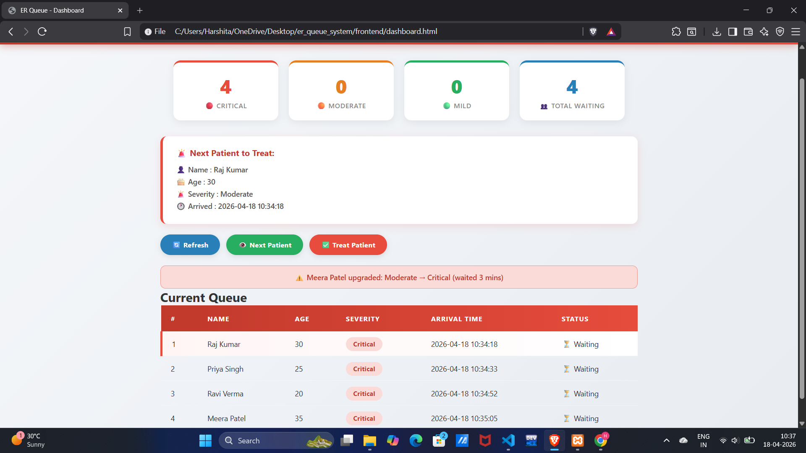

# 🏥 Emergency Room Patient Queue Management System

> A real-world web application that manages hospital emergency patients 
> using a **Priority Queue implemented as a Max Heap** data structure.

---

## 📌 Problem Statement

In busy hospital emergency rooms, patients are often managed manually 
on paper registers using first-come-first-served order. This causes 
critical patients to sometimes wait behind mild cases, potentially 
endangering lives. Additionally, mild patients can wait indefinitely 
as more critical cases keep arriving — a problem known as 
**Patient Starvation**.



---

## ✅ Our Solution

This system automates emergency room queue management using:
- **Max Heap** for O(log n) priority-based queue management
- **Dynamic Priority Aging** to prevent patient starvation
- **Real-time dashboard** for nurses and doctors
- **MySQL database** for permanent record storage

---

## 🔑 Unique Feature — Dynamic Priority Aging

Unlike existing systems that use static priority, our system 
automatically upgrades patient severity based on waiting time:

| Condition | Waiting Time | Action |
|-----------|-------------|--------|
| Mild patient | > 60 minutes | Upgraded to Moderate |
| Moderate patient | > 45 minutes | Upgraded to Critical |

This prevents any patient from being permanently ignored.

---

## 🛠️ Tech Stack

| Layer | Technology |
|-------|-----------|
| Frontend | HTML, CSS, JavaScript |
| Backend | Python (Flask) |
| Database | MySQL |
| DSA | Max Heap (implemented from scratch) |

---

## 📁 Project Structure
er_queue_system/
├── backend/
│   ├── app.py        ← Flask server + heap loader
│   ├── db.py         ← MySQL connection
│   ├── heap.py       ← Max Heap DSA implementation
│   └── routes.py     ← All API endpoints
└── frontend/
├── index.html    ← Patient registration form
├── dashboard.html← Real-time queue dashboard
└── style.css     ← Styling

---

## ⚙️ How to Run

### Prerequisites
- Python 3.x
- XAMPP (MySQL + Apache)
- VS Code

### Installation

**1. Clone the repository:**
```bash
git clone https://github.com/YourUsername/er-queue-system.git
```

**2. Install Python dependencies:**
```bash
pip install flask flask-cors mysql-connector-python
```

**3. Setup MySQL:**
- Start XAMPP → Start Apache + MySQL
- Open phpMyAdmin → http://localhost/phpmyadmin
- Create database: `er_queue`
- Run SQL:
```sql
CREATE TABLE patients (
    id INT AUTO_INCREMENT PRIMARY KEY,
    name VARCHAR(100) NOT NULL,
    age INT NOT NULL,
    severity VARCHAR(20) NOT NULL,
    arrival_time DATETIME DEFAULT CURRENT_TIMESTAMP,
    status VARCHAR(20) DEFAULT 'Waiting'
);
```

**4. Run the backend:**
```bash
cd backend
python app.py
```

**5. Open frontend:**
- Open `frontend/index.html` in browser for registration
- Open `frontend/dashboard.html` for queue dashboard

---

## 🧠 DSA Concepts Used

### Max Heap
Asha (Critical=3)
   /                \
   Raj (Moderate=2)    Ravi (Mild=1)
Array: [Asha, Raj, Ravi]

### Time Complexity
| Operation | Complexity |
|-----------|-----------|
| Add Patient (Insert) | O(log n) |
| View Next Patient (Peek) | O(1) |
| Treat Patient (Remove Max) | O(log n) |
| Priority Aging Check | O(n) |
| Space Complexity | O(n) |

---

## 🔗 API Endpoints

| Endpoint | Method | Description |
|----------|--------|-------------|
| `/add` | POST | Register patient → MySQL + Heap |
| `/queue` | GET | Get priority sorted queue |
| `/next` | GET | Peek at next patient (heap root) |
| `/treat` | POST | Treat patient → remove from heap |
| `/aging` | POST | Auto-upgrade severity by waiting time |

---

## 👩‍💻 Developer

**Harshita**
B.Tech CSE AIML | 2nd Semester
Noida Institute of Engineering and Technology

**Faculty:** Ms. Deepshikha Satsangi
**Course:** Data Structures and Algorithms - I
**Domain:** Good Health & Well-being

---

## 📄 License
This project is developed for academic purposes (PBL Assignment).
